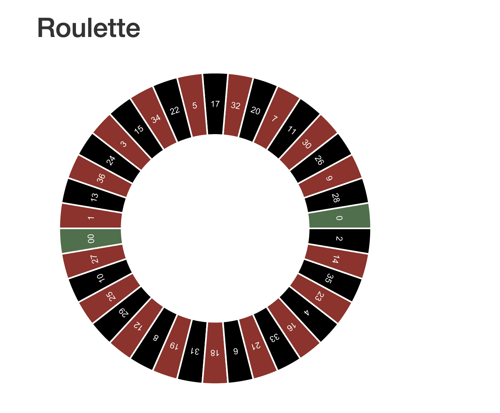
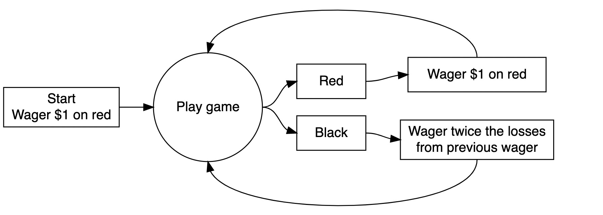

```{r global options, include = FALSE}
knitr::opts_chunk$set(echo=TRUE, warning=FALSE, message=FALSE, cache=TRUE)
```

# Introduction 
In this assignment, I will explain how to used computer simulation to understand the operating characteristics of the above strategy.

I will explain it from the following questions:

1, Explain how to used computer simulation to calculate the average earnings of a gambler that uses this strategy. 

2, Changing a parameter of the simulation (see table below) does or does not have an impact on average earnings. 

3, See the stopping rule below. Explain how to used computer simulation to estimate the average number of plays before stopping. 

4, Explain the limitations of the simulation; identify simplifications or other sources of uncertainty.

---

## Background
“Martingale” strategy is a classic roulette strategy.
This is how you include an image:




A roulette table composed of 38 evenly sized pockets on a wheel. The pockets includes 18 are red, 18 are black, and 2 are green. The pockets are also numbered. Roulette is a game of chance in which a pocket is randomly selected. Gamblers may wager on several aspects of the outcome. For example, one may place a wager that the randomly selected pocket will be red or odd numbered or will be a specific number. Each time a gambler loses a bet, he doubles his next bet, so that the eventual win leaves him with profit equal to his original stake. 

*For example:* 

(1)You have $200 starting budget and you initially bet $x. If you win, bet $x on the next round. If you lose, double your previous bet which is $2x. In short, if you lose n times in a row, you need to bet $(2^n)x. 

(2)We make 2^n < 200, then we get n<=7. So when n=7, which means we lose 7 times in a row, then the game is over, and we don't have enough money to play the next round. 

(3)We need 2^8-200=$56 to have enough money to continue the game.

(4)We know that there are 38 pockets, 18 are red and 18 are black. So placing bets on red or black are both have the probability P(red)=P(black)=18/38.

->P(win)=18/38 

->P(lose)=1-P(win)=20/38 


# Methods
```{r}
# This is a code comment
#From this picture, we set the sample size n=100, the probability of success p=0.2. We can find that as we run the code each time, this graph changes, the Frequency of success is random each time. The frequency of failure is around 80 times, and success is around 20 times.

# we want a success vector with n is the sample size and p the probability of success
n=100
p=0.2
success.vec = rbinom(n,1,p)
success.vec
# Histogram to analyze frequencies of success vector
hist(success.vec)
```

**Explanation: From this picture, we set the sample size n=100, the probability of success p=0.2. We can find that as we run the code each time, the line of values change, and the graph changes, the Frequency of success and failure is random each time. The frequency of failure is around 80 times, and success is around 20 times.**

---

**Change the sample size to 200:**
```{r}
# This is a code comment
# we want a success vector with n is the sample size and p the probability of success
n=200
p=0.2
success.vec2 = rbinom(n,1,p)
success.vec2
# Histogram to analyze frequencies of success vector
hist(success.vec2)
```

# Results 
```{r}
# Summary of success vector
summary(success.vec) #n=100

summary(success.vec2) #n=200
```
**Explanation: We change the sample size n from 100 to 200, we can find that the mean change each time.So it has an impact on average earnings. Because the sample size changes, and the probabilities of appearing 0 and 1 are different, which may led the different of average earnings**


**We can find that as we run the code each time, other values change each time. But the min value is always 0.0, and the max value is always 1.00. Because it can only appear 0 or 1** 

Min.: the smallest value of the line;

1st Qu: 25th percentile, value in the quarter of the line;

Median: value in the middle of the line;

Mean: the mean of this set of values

3rd Qu.: 75th percentile, value in the three-quarter of the line

---

**When we assume some parameters to descript starting value:**

B:	Starting budget	$200

W:	Winnings threshold for stopping	$300 (Starting budget + $100 winnings)

L:	Time threshold for stopping	1000 plays

M:	Casino’s maximum wager	$100


**Stopping rules:**

if(ending budget<=0)

if(game index>=max plays)

if(ending budget>=winning threshold)


**(1) used computer simulation to calculate the average earnings of a gambler that uses this strategy:**
```{r}
library(tidyverse)
#' A single play of the Martingale strategy
#'
#' Takes a state list, spins the roulette wheel, returns the state list with updated values (for example, budget, plays, etc)
#' @param state A list with the following entries: 
#'   B              number, the budget
#'   W              number, the budget threshold for successfully stoping
#'   L              number, the maximum number of plays 
#'   M              number, the casino wager limit
#'   plays          integer, the number of plays executed
#'   previous_wager number, the wager in the previous play (0 at first play)
#'   previous_win   TRUE/FALSE, indicator if the previous play was a win (TRUE at first play)
#' @return The updated state list
one_play <- function(state){
  
    # Wager
    proposed_wager <- ifelse(state$previous_win, 1, 2*state$previous_wager)
    wager <- min(proposed_wager, state$M, state$B)
    
    # Spin of the wheel
    red <- rbinom(1,1,18/38)
    
    # Update state
    state$plays <- state$plays + 1
    state$previous_wager <- wager
    if(red){
      # WIN
      state$B <- state$B + wager
      state$previous_win <- TRUE
    }else{
      # LOSE
      state$B <- state$B - wager
      state$previous_win <- FALSE
    }
  state
}


#' Stopping rule
#'
#' Takes the state list and determines if the gambler has to stop
#' @param state A list.  See one_play
#' @return TRUE/FALSE
stop_play <- function(state){
  if(state$B <= 0) return(TRUE)
  if(state$plays >= state$L) return(TRUE)
  if(state$B >= state$W) return(TRUE)
  FALSE
}


#' Play roulette to either bankruptcy, success, or play limits
#'
#' @param B number, the starting budget
#' @param W number, the budget threshold for successfully stoping
#' @param L number, the maximum number of plays 
#' @param M number, the casino wager limit
#' @return A vector of budget values calculated after each play.
one_series <- function(
    B = 200
  , W = 300
  , L = 1000
  , M = 100
){

  # initial state
  state <- list(
    B = B
  , W = W
  , L = L
  , M = M
  , plays = 0
  , previous_wager = 0
  , previous_win = TRUE
  )
  
  # vector to store budget over series of plays
  budget <- rep(NA, L)
  
  # For loop of plays
  for(i in 1:L){
    new_state <- state %>% one_play
    budget[i] <- new_state$B
    if(new_state %>% stop_play){
      return(budget[1:i])
    }
    state <- new_state
  }
  budget    
}

# helper function
get_last <- function(x) x[length(x)] 


# Simulation
walk_out_money <- rep(NA, 10000)
for(j in seq_along(walk_out_money)){
  walk_out_money[j] <- one_series(B = 200, W = 300, L = 1000, M = 100) %>% get_last
}

# Walk out money distribution
hist(walk_out_money, breaks = 100)

# Estimated probability of walking out with extra cash
mean(walk_out_money > 200)

# Estimated earnings
mean(walk_out_money - 200)

```

**Explaination: The frequency of 0 and 1 are different and change every time. We can estimate the probability of walking out with extra cash is  0.5152. So there is about a 50% probability that we will end up making extra money, and almost a 50% probability that we will end up losing money. We can also estimate our final average earnings is -45.416, which means we will lose about $45 (the graph and the values change each time).**


##Change B from 200 to 500
```{r}
library(tidyverse)
#' A single play of the Martingale strategy
#'
#' Takes a state list, spins the roulette wheel, returns the state list with updated values (for example, budget, plays, etc)
#' @param state A list with the following entries: 
#'   B              number, the budget
#'   W              number, the budget threshold for successfully stoping
#'   L              number, the maximum number of plays 
#'   M              number, the casino wager limit
#'   plays          integer, the number of plays executed
#'   previous_wager number, the wager in the previous play (0 at first play)
#'   previous_win   TRUE/FALSE, indicator if the previous play was a win (TRUE at first play)
#' @return The updated state list
one_play <- function(state){
  
    # Wager
    proposed_wager <- ifelse(state$previous_win, 1, 2*state$previous_wager)
    wager <- min(proposed_wager, state$M, state$B)
    
    # Spin of the wheel
    red <- rbinom(1,1,18/38)
    
    # Update state
    state$plays <- state$plays + 1
    state$previous_wager <- wager
    if(red){
      # WIN
      state$B <- state$B + wager
      state$previous_win <- TRUE
    }else{
      # LOSE
      state$B <- state$B - wager
      state$previous_win <- FALSE
    }
  state
}


#' Stopping rule
#'
#' Takes the state list and determines if the gambler has to stop
#' @param state A list.  See one_play
#' @return TRUE/FALSE
stop_play <- function(state){
  if(state$B <= 0) return(TRUE)
  if(state$plays >= state$L) return(TRUE)
  if(state$B >= state$W) return(TRUE)
  FALSE
}


#' Play roulette to either bankruptcy, success, or play limits
#'
#' @param B number, the starting budget
#' @param W number, the budget threshold for successfully stoping
#' @param L number, the maximum number of plays 
#' @param M number, the casino wager limit
#' @return A vector of budget values calculated after each play.
one_series <- function(
    B = 500
  , W = 300
  , L = 1000
  , M = 100
){

  # initial state
  state <- list(
    B = B
  , W = W
  , L = L
  , M = M
  , plays = 0
  , previous_wager = 0
  , previous_win = TRUE
  )
  
  # vector to store budget over series of plays
  budget <- rep(NA, L)
  
  # For loop of plays
  for(i in 1:L){
    new_state <- state %>% one_play
    budget[i] <- new_state$B
    if(new_state %>% stop_play){
      return(budget[1:i])
    }
    state <- new_state
  }
  budget    
}

# helper function
get_last <- function(x) x[length(x)] 


# Simulation
walk_out_money <- rep(NA, 10000)
for(j in seq_along(walk_out_money)){
  walk_out_money[j] <- one_series(B = 500, W = 300, L = 1000, M = 100) %>% get_last
}

# Walk out money distribution
hist(walk_out_money, breaks = 100)

# Estimated probability of walking out with extra cash
mean(walk_out_money > 200)

# Estimated earnings
mean(walk_out_money - 200)

```
**When we change the initial budget from $200 to $500, we can easily find that the probability of walking out with extra cash changes and the earnings also changes each time. So it has an impact on average earnings when we change the parameters.** 


**(2) provide a figure (or a series of figures) that show how the gamblers earnings (or losses) evolve over a series of wagers at the roulette wheel. (The x-axis will be the wager number (or play number), the y-axis will be earnings.) **
```{r}
single_spin <- function(){
  possible_outcomes <- c(rep("red",18), rep("black",18), rep("green",2))
  sample(possible_outcomes, 1)
}

martingale_wager <- function(
  previous_wager
  , previous_outcome
  , max_wager
  , current_budget
){
  if(previous_outcome == "red") return(1)
  min(2*previous_wager, max_wager, current_budget)
}

one_play <- function(previous_ledger_entry, max_wager){
  # Create a copy of the input object that will become the output object
  out <- previous_ledger_entry
  out[1, "game_index"] <- previous_ledger_entry[1, "game_index"] + 1
  out[1, "starting_budget"] <- previous_ledger_entry[1, "ending_budget"]
  out[1, "wager"] <- martingale_wager(
    previous_wager = previous_ledger_entry[1, "wager"]
    , previous_outcome = previous_ledger_entry[1, "outcome"]
    , max_wager = max_wager
    , current_budget = out[1, "starting_budget"]
  )
  out[1, "outcome"] <- single_spin()
  out[1, "ending_budget"] <- out[1, "starting_budget"] + 
    ifelse(out[1, "outcome"] == "red", +1, -1)*out[1, "wager"]
  return(out)
}

one_series <- function(
  max_games, starting_budget, winning_threshold, max_wager
){
  # Initialize ledger
  ledger <- data.frame(
      game_index = 0:max_games
    , starting_budget = NA_integer_
    , wager = NA_integer_
    , outcome = NA_character_
    , ending_budget = NA_integer_
  )
  ledger[1, "wager"] <- 1
  ledger[1, "outcome"] <- "red"
  ledger[1, "ending_budget"] <- starting_budget
  for(i in 2:nrow(ledger)){
    #browser()
    ledger[i,] <- one_play(ledger[i-1,], max_wager)
    if(stopping_rule(ledger[i,], winning_threshold)) break
  }
  # Return non-empty portion of ledger
  ledger[2:i, ]
}

stopping_rule <- function(
  ledger_entry
  , winning_threshold
){
  ending_budget <- ledger_entry[1, "ending_budget"]
  if(ending_budget <= 0) return(TRUE)
  if(ending_budget >= winning_threshold) return(TRUE)
  FALSE
}

profit <- function(ledger){
  n <- nrow(ledger)
  profit <- ledger[n, "ending_budget"] - ledger[1, "starting_budget"]
  return(profit)
}

require(magrittr)

svg(filename = "loser.svg", width=16, height =9)
par(cex.axis=2, cex.lab = 2, mar = c(8,8,2,2), bg = rgb(222, 235, 247, max = 255))
set.seed(1)
ledger <- one_series(200,200,300,500)
plot(ledger[,c(1,5)], type = "l", lwd = 5, xlab = "Game Index", ylab = "Budget")
dev.off()

svg(filename = "winner.svg", width=16, height =9)
par(cex.axis=2, cex.lab = 2, mar = c(8,8,2,2), bg = rgb(222, 235, 247, max = 255))
set.seed(2)
l2 <- one_series(200,200,300,500)
plot(l2[,c(1,5)], type = "l", lwd = 5, xlab = "Game Index", ylab = "Budget")
dev.off()


```
**Explanation: **
**An example of one gambler who walked into the casino with 200 and left the casino with zero dollars. We can take a look at these plots to get a sense for the growth rate or the loss rate.**

**We can see the budget we initially have is 200, The budget was stable between 0-20 in the game index, but when it approached 20, the gambler lost money and bet out double , so the budget dropped suddenly. After game index is 20,the gambler won the money. the budget suddenly growed, and then leveled off again. When it tends to 60, budjet suddenly drops again, and around 65 game indexs, budget drops to 0.**

**For example, in the first game the player may start with $200 as directed by the martingale strategy the player will wager $1. The outcome of the first game is recored next and may happen to be read. The winnings are added to the budget and player now has $201. The ledger records the information from teh subsequent plays and the wagers change according to the strategy, and the ending budgets change according to the luck of the player.**

**The starting budget for game two is implied by the ending budget from the game one.Likewise the amount to wager in game two is calculated from the maximun casino wager and from wager outcome and ending budget information in the ledger entry for game one.(see martingale_wager() function) The ending budget can be updated appropriately to reflect teh wins and losses of the gamble.**

---

## Hints

This is how you report inline stats like the mean: `r mean(success.vec)`.

You may include latex if needed: 

$$P(AB)=P(A)+ P(B) - P(AB)$$

Here is an example inline Table:

| One | Two | Three | Four |
|:---:|:---:|:-----:|:----:|
|  1  |   1 |  a    |  -1  |
|  2  |   2 |  b    |   -3 |
|  3  |   4 |  c    |   +1 |


Illustration of a martingale with formulas :

| Play | 	Wager | Outcome | Earnings           | Probability|
|:---: |:---:   |:-----:  |:----:              |:----: |
|  1   |   1    |  black  |   -1               |(1-P)|
|  2   |   2    |  black  |   -3               |(1-P)^2|
|  3   |   4    |  black  |   -7               |(1-P)^3|
| ...  | ...    | ...     | ...                |...|
| n-1  |2^(n-2) |  black  |-(1+2+4+...+2^(n-2))|(1-P)^(n-1)|
| n    |2^(n-1) |  red    |+1                  |(1-P)^(n-1)P|


---

# Conclusions
In summary,  We can use computer simulation to understand the operating characteristics of the above strategy.

We set some parameters, and make some functions, then we run the code. It provides a series of figures that show how the gamblers earnings (or losses) evolve over a series of wagers at the roulette wheel. We can see the impact on average earnings if we change the parameters of the simulation. From the graph, we can also find the average earnings of a gambler that uses this strategy.

Martingale System advocates will use the following logic to ‘prove’ the systems validity: The probability of a roulette wheel never coming up black is zero, assuming that the wheel has a fair and unbiased spin. Or to be more accurate, the probability of the result of a roulette wheel never being black approaches zero as the number of spins approaches infinity.
But **the limitations of the simulation**:the martingale system only works safely in casinos without table limits and where the gambler has unlimited money. Both of which do not exist. Therefore, the martingale strategy is considered extremely risky. 


