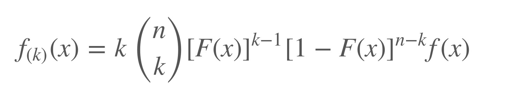
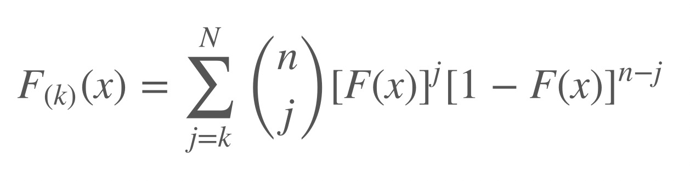

##Which quantiles of a continuous distribution can one estimate with more precision?

### Introduction

The median is an important quantity in data analysis. It represents the middle value of the data distribution. Estimates of the median, however, have a degree of uncertainty because (a) the estimates are calculated from a finite sample and (b) the data distribution of the underlying data is generally unknown. One important roles of a data scientist is to quantify and to communicate the degree of uncertainty in his or her data analysis.

In this blog, I will answer a series of questions related to the variation of the median (and a range of other quantiles) and I will also use some analytic methods to answer these questions.


### Questions & Solution

#### Q1: Begin with the median from a sample of N = 200 from the standard normal distribution. Write an R function that is the density function for the median in this sample. Note that the 100th order statistic is approximately the median, and use the order statistic formula discussed in class. Generate a plot of the function.


```{r}
dorder= function(x,n,k){
  k*choose(n,k)*
    (pnorm(x))^(k-1)*
    (1-pnorm(x))^(n-k)*
    dnorm(x)
}
x=seq(-5,5,by=0.01)

density=dorder(x,n=200,k=100)
plot(x,density,type="l")

```

for the normal distribution , the mean and the median are about the same, both close to 0.


#### Q2: Write an R function that is the probability function for the median in this sample. Use the order statistic formula discussed in class. Generate a plot of the function.



```{r}
porder= function(x,n,k){
  pbinom(k-1,n,pnorm(x),lower.tail=FALSE)
  
  #for example
  #pbinom(5,2,.3)=dbinom(5,0,.3)+dbinom(5,1,.3)+dbinom(5,2,.3)
  #pbinom(5,2,.3,lower.tail=FALSE)=dbinom(5,3,.3)+dbinom(5,4,.3)+dbinom(5,5,.3)
}
x=seq(-5,5,by=0.01)
plot(x,porder(x,n=200,k=100),type ="l")


```

#### Q3: Write an R function that is the quantile function for the median in this sample. (You have several options for how to write this function.) Generate a plot of the function.-CDF
```{r}
p=ppoints(200) #between 0 and 1

qorder=function(p,n,k){
  out=p
  for(i in seq_along(p)){
    #The function uniroot searches the interval from lower to upper for a root (i.e., zero) of the function f with respect to its first argument.
    out[i]=uniroot(function(x) {porder(x,n,k)-p[i]},c(-100,100))$root
    
  }
out    
}
qtv=qorder(p,n=200,k=100)
plot(p,qtv,type="l")

```

#### Q4:Simulate the sampling distribution for the median. Create a plot of the empirical CDF (ECDF).Overlay the plot of the ECDF with a plot of the CDF.

```{r}
#first step: need to sample rnorm(200) and compute median
temp=rnorm(200)
med1=median(temp) #close to 0 
#second step: repeat this  1000 times
median_values=NA
for(i in 1:1000){
  temp=rnorm(200)
  median_values[i]=median(temp) 
}
# third step: you have 1000 median values, then use ecdf(), then plot(ecdf())
plot(ecdf(median_values),main="",lwd=3,col="red")
#curve(theoretical cdf from standard normal)
curve(pnorm(x,mean(median_values),sd(median_values)),add=TRUE,lwd=3,col="blue")
legend(
"topleft"
, c("ECDF","CDF") ,lwd=3
, col = c("red","blue") ,bty="n"
)


```


#### Q5: Using the simulated sampling distribution from the previous question, create a histogram (on the density scale). Overlay the histogram with a plot of the density function.
```{r}
library(tidyverse)
#first step: need to sample rnorm(200) and compute median
temp=rnorm(200)
med1=median(temp) #close to 0 

#second step: repeat this  1000 times
for(i in 1:100){
  temp=rnorm(200)
  median_values[i]=median(temp)
}


# third step: you have 1000 median values
hist(median_values,main="Sampling distribution of median",freq=FALSE)
#curve(add theoretical pdf for median of standard normal)
curve(dnorm(x,mean(median_values),sd(median_values)),add=TRUE,lwd=3,col="blue")


```


#### Q6: One very common way to compare a random sample to a theoretical candidate distribution is the QQ plot. It is created by ploting quantiles of the theoretical distribution on the x-axis and empirical quantiles from the sample on the y-axis.

If sample and theoretical quantiles come from the same distribution, then the plotted points will fall along the line y = x, approximately. Here are two examples when the sample and theoretical quantiles came from the same distribution.
```{r}
medians=NA

for(k in 1:1000){
  temp=rnorm(200)
  medians[k]=median(temp) #get 1000 median values
}

p=ppoints(200)

x=qorder(p,n=200,k=100)  #use the function from Q3
y=quantile(medians,probs=p)

plot(x,y)
abline(c(0,1))  #reference line

```
The two lines are close means: empirical distribution(ecdf) is very close to theoretical distribution


#### Q7: Modify the dorder , porder , and qorder functions so that the functions take a new parameter k (for the k-th order statistic) so that the functions will work for any order statistic and not just the median.
```{r}
library(magrittr)
fk <- function(x,k,n,dist="norm",...){
  F <- eval(parse(text="p" %|% dist))
  f <- eval(parse(text="d" %|% dist))
  k*
    choose(n,k)*
    (F(x, ...))^(k-1)*
    (1-F(x, ...))^(n-k)*
    f(x, ...)
}

out <- replicate(
  1000
  , {
    ft1 <- rweibull(3,shape=1.3,scale=2)
    c(ft1 %>% min, ft1 %>% max)
  }) %>%
  t

hist(out[,1],freq=FALSE,breaks=100, xlim=c(0,max(out)))
#curve(fk(x,mean(x),sd(x),dist="weibull",shape=1.3, scale=2),add=TRUE,lwd=5,col="red")
``` 

#### Q8: Generate the QQ plot for simulated data from the sampling distribution of the sample max and the theoretical largest order statistic distribution.
```{r}
maxs=NA

for(k in 1:1000){
  temp=rnorm(200)
  maxs[k]=max(temp) #get 1000 median values
}

p=ppoints(200)

x=qorder(p,n=200,k=200)  #use the function from Q3 , change k =max=200
y=quantile(maxs,probs=p)

plot(x,y)
abline(c(0,1))  #reference line

```

#### Q9: Modify the dorder , porder , and qorder functions so that the functions take new parameters dist and ... so that the functions will work for any continuous distribution that has d and p functions defined in R.
```{r}
dorder_n = function(x,n,k,dist="norm",...){
  pfn=get(paste0("p",dist)) #probability function, get(): make the pnorm as a function
  dfn=get(paste0("d",dist)) #density function, dnorm
  
  #order statistic -dorder, change pnorm to pfn, change dnorm to dfn
  k*choose(n,k)*
    (pfn(x,...))^(k-1)*
    (1-pfn(x,...))^(n-k)*
    dfn(x,...)
  
}

x=seq(-10,10,by=0.1)
density=dorder_n(x,n=200,k=100,dist="norm",mean=3, sd=2) 
plot(x,density) #get the density for median 
#when the density reach the peak, x should be close to 3, because normal distribution mean and median is about the same.


#the gamma distribution should have shape and scale parameters, either rate or scale(either one of these),so we need 2 parameters to define gamma distribution
porder_n = function(x,n,k,dist="gamma",...){
  pfn=get(paste0("p",dist)) #probability function, pgamma
  dfn=get(paste0("d",dist)) #density function, dgamma
   
  pbinom(k-1,n,pnorm(x),lower.tail=FALSE)
  
}

x=seq(0,10,by=0.01)
density=porder_n(x,n=200,k=100,dist="gamma",shape=3,scale=2)  #get density of order statistic 
plot(x,density)


p=ppoints(200) #between 0 and 1
porder_n = function(p,n,k,dist="gamma",...){
  pfn=get(paste0("p",dist)) #probability function, pgamma
  dfn=get(paste0("d",dist)) #density function, dgamma
  out=p
  for(i in seq_along(p)){
    #The function uniroot searches the interval from lower to upper for a root (i.e., zero) of the function f with respect to its first argument.
    out[i]=uniroot(function(x) {porder(x,n,k)-p[i]},c(-100,100))$root
    
  }
out    
}

x=seq(0,10,by=0.01)
qtv=qorder(p,n=200,k=100) #get density of order statistic 
plot(p,qtv,type="l")
```


#### Q10: Use the newly modified functions to plot the probability(cdf) and density functions(pdf) for the sample min (N = 200).-> min: k=1
```{r}

#pdf
dorder= function(x,n,k){
  k*choose(n,k)*
    (pnorm(x))^(k-1)*
    (1-pnorm(x))^(n-k)*
    dnorm(x)
}
x=seq(-5,5,by=0.01)

#min
probability=dorder(x,n=200,k=1)
plot(x,probability,type="l",main="PDF for the sample min")
  


#cdf
porder= function(x,n,k){
  pbinom(k-1,n,pnorm(x),lower.tail=FALSE)
}

#min
x=seq(-5,5,by=0.01)
density=porder(x,n=200,k=1)
plot(x,density,type ="l",main="CDF for the sample min")


```

